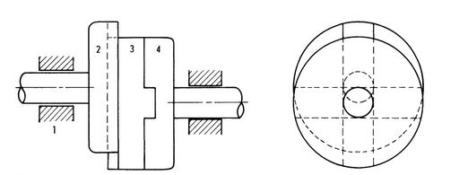
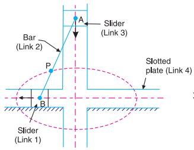
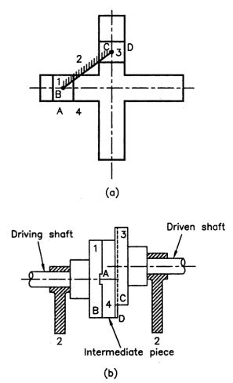

# Introduction
A mechanism is a combination of rigid or restraining bodies so shaped and connected that they move upon each other with a definite relative motion. A machine is a mechanism or a collection of mechanisms which transmits force from the source of power to the resistance to be overcome,and thus perform a mechanical work. Mechanisms generally consist of moving components such as gears and gear trains, belt and chain drives, cam and follower mechanisms, and linkages as well as friction devices such as brakes and clutches, and structural components such as the frame, fasteners, bearings, springs, lubricants and seals, as well as a variety of specialized machine elements such as splines, pins and keys.

A coupling is a device used to connect two shafts together at their ends for the purpose of transmitting power. Couplings do not normally allow disconnection of shafts during operation, however there are torque limiting couplings which can slip or disconnect when some torque limit is exceeded.

An Oldham′s coupling is a third inversion of double slider crank chain and which is obtain by fixing the connecting link.It is used to join two shafts which have lateral mis-alignment. It consists of two flanges A and B with slots and a central floating part E with two tongues T1 and T2 at right angles as shown in Fig. 1. The central floating part is held by means of a pin passing through the flanges and the floating part. The tongue T1 fits into the slot of flange A and allows for �to and fro� relative motion of the shafts, while the tongue T2 fits into the slot of the flange B and allows for vertical relative motion of the parts. The resultant of these two components of motion will accommodate lateral misalignment of the shaft as they rotate.

***Figure 1:***

# Theory
From the definition of mechanisms it can be realize that by fixing the links of a closed chain one at a time, we can get as many different mechanisms as the numbers of link in the chain. This process of fixing different links of a same kinematic chain to produce distinct mechanisms is called kinematic inversion. By distinct, it is meant that the input-output relation as given by the absolute motions of the links connected to the frame is different for these mechanisms. An Oldham′s coupling is a third inversion of double slider crank chain.

## Inversions of Double Slider Crank Chain

A double slider crank chain consists of four links forming two sliding pairs and two turning pairs. Hence, the two pairs of the same kind are adjacent. They are three important inversions of double slider crank chain. 1) Elliptical trammel. 2) Scotch yoke mechanism. 3) Oldham′s Coupling. The line diagram of the double slider crank chain is shown in Fig.

## Oldham′s coupling:

An Oldham's coupling is a third inversion of double slider crank chain and which is obtain by fixing the connecting link (link 2). Each of the two die-blocks may then turn bout the pins B and C. If one block is turned through a definite angle, the frame and the other block must turn through the same angle and as rotation takes place , the frame will slide relative to each of the two blocks. This coupling is used for connecting two parallel shafts when the distance between the shafts is small. The two shafts to be connected have flanges at their ends, secured by forging. Slots are cut in the flanges.

In Oldham's coupling, each half-coupling is identical in the form and hasa single groove cut diametrically across the face. A circular disc with a tongue passing diametrically across each face and the two tongues set at right angles to each other is placed between the two half couplings, so that each tongue fits into its corresponding groove in one of the half couplings. When the driving shaft 1 is rotated, the flange B (link 1) causes the intermediate piece (link 4) to rotate at the same angle through which flange B has rotated and it further rotates the flange C (link 3) at the same angle and thus the shaft 3 rotates. Hence, links 1,3 and 4 have the same angular velocity at every instant. A little consideration will show, that there is a sliding motion between the link 4 and each of the other links 1 and 3.

As stated earlier an Oldham's coupling is used for connecting two parallel shafts whose axes are at a small distance span. If the distance between the axes of the shafts is constant, the centre of intermediate piece will describe a circle of radius equal to the distance between the axes of the two shafts. Therefore, the maximum sliding speed of each tongue along its slot is equal to the peripheral velocity of the centre of the disc along its circular path.

- Link 1: Slider
- Link 2: Connecting Link, Fixed Link
- Link 3: Slider
- Link 4: Slotted Frame

Let, w= Angular velocity of each shaft in rad/s and r=Distance between the axes of the shafts in meters. Therefore, maximum sliding speed of each tongue in m/s is given by; v=r.w

# Video Tutorial

## Oldhams Coupling

<video width="420" height="340" controls=""><source src="./images/part2.mp4" type="video/mp4"></video>

